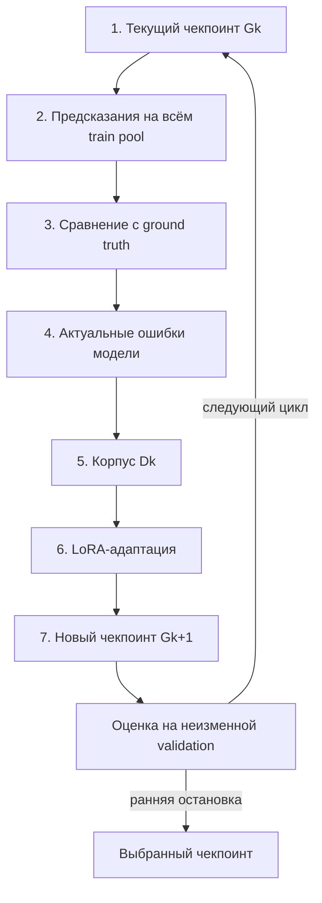

# Применение мультимодальных больших языковых моделей в задачах автоматической трансляции графических математических выражений в код LaTeX

Репозиторий содержит программную и экспериментальную часть дипломной работы,
посвящённой применению мультимодальных больших языковых моделей для
преобразования изображений математических выражений в код LaTeX.

## Аннотация

Автоматическая трансляция математических выражений требует распознавания не
только отдельных символов, но и их двумерной структуры: дробей, индексов,
степеней, радикалов, матриц и вложенных конструкций. В работе в качестве
базовой мультимодальной модели используется Uni-MuMER на основе
Qwen2.5-VL-3B. Экспериментальная часть сосредоточена на рукописных формулах из
MathWriting и CROHME.

Предлагаемый метод Dynamic Error Corpus обновляет обучающий корпус после
каждого цикла адаптации. В новый корпус входят ошибки, которые допускает
текущий чекпоинт, а не только исходная версия модели.

## Цель и задачи

**Цель работы:** разработать и исследовать метод адаптации мультимодальной
большой языковой модели для повышения качества автоматического преобразования
изображений математических выражений в LaTeX.

**Объект исследования:** автоматическое распознавание графических
математических выражений.

**Предмет исследования:** методы адаптации мультимодальных больших языковых
моделей с использованием динамически обновляемого корпуса ошибок.

Для достижения цели решаются следующие задачи:

1. Исследовать существующие подходы к распознаванию математических выражений.
2. Подготовить MathWriting для обучения и CROHME 2014, 2016 и 2019 для
   тестирования.
3. Реализовать построение статического и динамического корпусов ошибок.
4. Выполнить LoRA-адаптацию языковой и визуальной частей Uni-MuMER.
5. Сравнить исходную модель, обычную LoRA, Static EDL и Dynamic EDL.
6. Оценить модели по ExpRate, CDM, CER, BLEU и переходам между правильными и
   неправильными ответами.

## Предлагаемый метод

Основная идея состоит в том, чтобы после каждого цикла заново строить
обучающий корпус из ошибок текущего чекпоинта модели.

> Метод не относится к обучению с подкреплением. Все обучаемые варианты
> используют дообучение с учителем, LoRA и опубликованные промпты Uni-MuMER.

## Исследовательская гипотеза

Обучение на актуальных ошибках текущего чекпоинта Uni-MuMER должно лучше
переноситься на неизвестные изображения, чем обучение на корпусе ошибок,
который остаётся неизменным после первого цикла.

Во всех вариантах измеряется одна и та же задача прямого распознавания:

```text
изображение формулы -> Uni-MuMER -> LaTeX
```

Задачи поиска и исправления ошибок используются только при обучении. На
валидации и тесте модель не получает предыдущее предсказание.

## Сравниваемые варианты

| Обозначение | Техническое имя | Обучение |
| --- | --- | --- |
| B0 | `frozen` | Исходная Uni-MuMER без адаптации |
| B1 | `recognition_lora` | LoRA на обычной задаче распознавания MathWriting |
| B2 | `static_error` | Повторное обучение на неизменном начальном корпусе `D0` |
| B3 | `dynamic_error` | Обучение на корпусах `D0, D1, ...`, построенных текущими чекпоинтами |

Все четыре варианта независимо оцениваются на CROHME 2014, 2016 и 2019.

## Схема Dynamic EDL



## Данные

| Набор данных | Роль | Количество примеров |
| --- | --- | ---: |
| MathWriting | Обучение, поиск ошибок и валидация | около 230 тыс. |
| CROHME 2014 | Внешний тест | 986 |
| CROHME 2016 | Внешний тест | 1 147 |
| CROHME 2019 | Внешний тест | 1 199 |

Нормализованный MathWriting из `phxember/Uni-MuMER-Data` один раз делится на
95% train pool и 5% validation с `seed=42`. Отдельный тест MathWriting не
используется. Все три CROHME применяются только для финального сравнения.

Train pool дополнительно разбивается на пять детерминированных частей
`S1...S5`. Они задают меняющийся приоритет при ранжировании, но каждый цикл
выполняет поиск ошибок на всём train pool.

## Состав корпуса

Каждое исходное изображение даёт не более одной обучающей записи за цикл:

- `error_find`: локализация ошибки в текущем предсказании;
- `error_fix`: описание операции и исправление формулы;
- `recognition`: прямое распознавание изображения в LaTeX;
- `keep`: сохранение уже правильного ответа;
- `replay`: повторное использование ошибки из предыдущих циклов.

Ошибки характеризуются CER, типом редактирования, уверенностью и приоритетом
части train pool. Изображение, выбранное в предыдущем цикле, пропускает один
цикл. Точные промпты Uni-MuMER находятся в
`src/dec_unimumer/prompts.py`.

## Результаты

### ExpRate, %

| Модель | CROHME 2014 | CROHME 2016 | CROHME 2019 | Среднее |
| --- | ---: | ---: | ---: | ---: |
| B0. Frozen Uni-MuMER | 82,05 | 77,94 | 79,23 | 79,74 |
| B1. Vanilla LoRA | 81,98 | 77,92 | 79,20 | 79,70 |
| B2. Static EDL | 82,10 | 78,01 | 79,31 | 79,81 |
| **B3. Dynamic EDL** | **82,66** | **78,29** | **80,40** | **80,45** |

### CDM и переходы относительно B0

| Модель | Средний CDM, % | Исправлено | Испорчено | Чистый прирост |
| --- | ---: | ---: | ---: | ---: |
| B0. Frozen Uni-MuMER | 82,86 | - | - | - |
| B1. Vanilla LoRA | 82,77 | 19 | **20** | -1 |
| B2. Static EDL | __82,94__ | __31__ | 29 | __+2__ |
| **B3. Dynamic EDL** | **83,39** | **45** | 21 | **+24** |

## Метрики

- **ExpRate**: доля точных совпадений после нормализации LaTeX;
- **CDM**: официальный Character Detection Matching из UniMERNet;
- **Исправлено**: пример был неправильным у B0 и стал правильным;
- **Испорчено**: пример был правильным у B0 и стал неправильным;
- **Чистый прирост**: `Исправлено - Испорчено`.

На validation эти метрики вычисляются после каждого цикла. Чекпоинт B3
выбирается по максимальному `net_fixed_count`. CROHME не участвует в выборе
чекпоинта.

## Установка

Референсная конфигурация рассчитана на Linux, CUDA, Python 3.12 и одну GPU с
16 ГБ памяти.

```bash
uv python install 3.12
uv sync
```

Загрузка нормализованного MathWriting:

```bash
uv run dec-download
```

Загрузка официального архива Uni-MuMER и подготовка трёх тестов CROHME:

```bash
uv run dec-prepare-crohme --download
```

Установка официального CDM evaluator в Docker:

```bash
bash scripts/setup_unimernet_cdm_docker.sh
```

## Запуск

Полный возобновляемый эксперимент B0-B3 запускается одной командой:

```bash
uv run bash scripts/run_experiment.sh
```

В референсной конфигурации используются bf16, LoRA в языковой и визуальной
частях модели, `max_pixels=160000`, отсутствие обрезания обучающих
последовательностей и `seed=42`. Аргументы командной строки переопределяют
параметры скрипта:

```bash
uv run bash scripts/run_experiment.sh --max-cycles 3 --attn-implementation sdpa
```

Успешные этапы получают маркер `.complete`. Повторный запуск пропускает
завершённые этапы и продолжает незавершённый inference.

## Структура репозитория

```text
src/dec_unimumer/              код эксперимента
src/dec_unimumer/latex/        нормализация LaTeX и метрики
scripts/run_experiment.sh      полный запуск B0-B3
docs/EXPERIMENT.md             формальный протокол эксперимента
```

Сгенерированные данные группируются по назначению и варианту модели:

```text
data/mathwriting/split/        train pool, validation и назначения S1-S5
data/mathwriting/corpora/      D0, D1, ...
data/crohme/{year}/test.jsonl  тестовые манифесты CROHME
outputs/mathwriting/{variant}/ предсказания, адаптеры и validation
reports/mathwriting/{variant}/ отчёты по каждому тесту
```

Отдельные этапы доступны через команды `dec-infer`, `dec-build-corpus`,
`dec-train` и `dec-evaluate`.


## Источники

- [Статья Uni-MuMER](https://arxiv.org/abs/2505.23566)
- [Код и тестовые данные Uni-MuMER](https://github.com/BFlameSwift/Uni-MuMER)
- [Набор Uni-MuMER Data](https://huggingface.co/datasets/phxember/Uni-MuMER-Data)
- [Модель Uni-MuMER](https://huggingface.co/phxember/Uni-MuMER-Qwen2.5-VL-3B)
- [CDM evaluator UniMERNet](https://github.com/opendatalab/UniMERNet)
